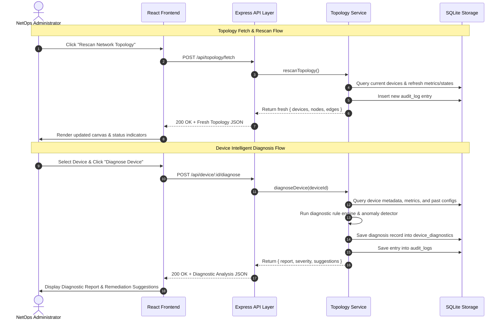

# NetOps AI Agent Backend Architecture & Data Persistence Specifications

## 1. System Overview & Layered Architecture

The NetOps AI Agent backend is an intelligent network topology diagnosis and management platform designed with a clean 3-layer architecture. It provides high-performance, persistent network state tracking, LLM provider management, RAG-based SOP retrieval, and automated device fault diagnosis.

```mermaid
graph TD
    subgraph Presentation Layer
        UI[React / Vite Frontend SPA]
        RF[ReactFlow Topology Canvas]
        MM[Model Marketplace Modal]
        KB[Knowledge Base Modal]
        AC[Agent Chat Panel]
    end

    subgraph Express RESTful API Layer
        API_TOP[/api/topology & /api/topology/fetch]
        API_DEV[/api/device/:id & /api/device/:id/diagnose]
        API_MOD[/api/models/providers, config, test-connection]
        API_KB[/api/kb/upload]
        API_AGT[/api/agent/chat]
    end

    subgraph Core Business Services Layer
        TS[Topology & Device Service]
        LLMGW[LLM Gateway & Key Proxy Service]
        RAG[RAG SOP Processing Service]
        AGENT[Agent Diagnosis & Context Engine]
    end

    subgraph Data & Storage Layer
        DB[(SQLite Persistent Storage netops.db)]
        T_DEV[devices / device_metrics / device_diagnostics / device_configs]
        T_TOP[topology_nodes / topology_edges]
        T_MOD[model_providers]
        T_KB[kb_documents / kb_chunks]
        T_LOG[audit_logs]
    end

    UI --> API_TOP
    RF --> API_TOP
    UI --> API_DEV
    MM --> API_MOD
    KB --> API_KB
    AC --> API_AGT

    API_TOP --> TS
    API_DEV --> TS
    API_MOD --> LLMGW
    API_KB --> RAG
    API_AGT --> AGENT

    AGENT --> TS
    AGENT --> LLMGW
    AGENT --> RAG

    TS --> DB
    LLMGW --> DB
    RAG --> DB
    AGENT --> DB

    DB --- T_DEV
    DB --- T_TOP
    DB --- T_MOD
    DB --- T_KB
    DB --- T_LOG
```

### Layer Responsibilities

1. **Layer 1: Data & Persistence Layer (SQLite)**
   - Utilizes Node.js native `node:sqlite` (`DatabaseSync`) for synchronous, lightweight, embedded relational persistence without external database server dependencies.
   - Houses 10 relational tables covering device inventory, real-time metrics, diagnostic records, device config histories, canvas node/edge topology, LLM provider credentials, RAG SOP documents/chunks, and audit logs.

2. **Layer 2: Core Business Logic Services**
   - **Topology & Device Service**: Manages device CRUD, canvas node/edge layout persistence, real-time metric generation, and device diagnostic execution.
   - **LLM Gateway & Key Proxy Service**: Encapsulates model provider credentials, manages API keys securely on the server side, and proxies health check connectivity tests to providers (DeepSeek, Dify, OpenAI, Ollama, Qwen, etc.).
   - **RAG SOP Processing Service**: Handles SOP markdown file ingestion, header-aware & QA-pair chunking, metadata extraction, and context retrieval.
   - **Agent Diagnosis Context Engine**: Fuses triple-context (Topology state + Device telemetry/alarms + SOP RAG chunks) to drive AI troubleshooting dialogues.

3. **Layer 3: Express RESTful API Layer**
   - Exposes clean, structured JSON endpoints under `/api/*`.
   - Connects Express middleware with core business services and Vite dev middleware for seamless SPA delivery.

---

## 2. Request Flow Diagrams

### 2.1 Topology Scanning & Device Diagnostics Flow



---

## 3. Detailed RESTful API Specifications

### 3.1 Topology & Device Endpoints

#### 1. `GET /api/topology`
- **Description**: Fetches current network topology graph including all devices, canvas nodes, and interconnecting edges.
- **HTTP Method**: `GET`
- **Path**: `/api/topology`
- **Request Headers**: `Accept: application/json`
- **Response Status**: `200 OK`
- **Response Body**:
```json
{
  "devices": {
    "core-router-1": {
      "id": "core-router-1",
      "type": "router",
      "name": "Core Router 1",
      "ip": "10.0.0.1",
      "mac": "00:1A:2B:3C:4D:5E",
      "gateway": "10.0.0.254",
      "subnetMask": "255.255.255.0",
      "status": "healthy",
      "metrics": {
        "cpu": 45,
        "memory": 60,
        "throughput": "10 Gbps",
        "latency": "2ms"
      },
      "diagnostics": null,
      "suggestions": [],
      "configHistory": [
        {
          "version": "v1.4",
          "date": "2026-08-01 10:00",
          "changes": "Updated OSPF route costs"
        }
      ]
    }
  },
  "nodes": [
    {
      "id": "core-router-1",
      "position": { "x": 400, "y": 150 },
      "data": { "label": "Core Router 1", "deviceId": "core-router-1" },
      "type": "default"
    }
  ],
  "edges": [
    {
      "id": "e-fw-core",
      "source": "edge-firewall-1",
      "target": "core-router-1",
      "animated": true
    }
  ]
}
```

#### 2. `POST /api/topology/fetch`
- **Description**: Triggers a network rescan simulation, updates real-time metrics in SQLite, and returns refreshed topology data.
- **HTTP Method**: `POST`
- **Path**: `/api/topology/fetch`
- **Request Headers**: `Content-Type: application/json`
- **Request Body**: `{}` (Optional parameters for targeted subnet scanning)
- **Response Status**: `200 OK`
- **Response Body**:
```json
{
  "success": true,
  "timestamp": "2026-08-03T16:50:00.000Z",
  "topology": {
    "devices": { "...": "..." },
    "nodes": [ "...": "..." ],
    "edges": [ "...": "..." ]
  }
}
```

#### 3. `GET /api/device/:id`
- **Description**: Retrieves detailed state, telemetry metrics, diagnostic history, and configuration history for a specific network device.
- **HTTP Method**: `GET`
- **Path**: `/api/device/:id` (e.g. `/api/device/dist-switch-1`)
- **Response Status**: `200 OK` (or `404 Not Found` if device does not exist)
- **Response Body**:
```json
{
  "id": "dist-switch-1",
  "type": "switch",
  "name": "Distribution Switch 1",
  "ip": "10.0.1.1",
  "mac": "00:1B:44:11:3A:B7",
  "gateway": "10.0.1.254",
  "subnetMask": "255.255.255.0",
  "status": "critical",
  "metrics": {
    "cpu": 95,
    "memory": 88,
    "throughput": "2 Gbps",
    "latency": "150ms"
  },
  "diagnostics": "Detected spanning tree loop on interface Gi1/0/2. High CPU utilization due to broadcast storm.",
  "suggestions": [
    "Shut down interface Gi1/0/2 immediately.",
    "Enable BPDU guard on edge ports.",
    "Review STP priority configuration."
  ],
  "configHistory": [
    {
      "version": "v2.1",
      "date": "2026-08-01 11:15",
      "changes": "Modified spanning tree priority"
    }
  ]
}
```

#### 4. `POST /api/device/:id/diagnose`
- **Description**: Executes intelligent fault diagnosis on the specified device, persists the diagnostic output in SQLite, logs the audit action, and returns actionable recommendations.
- **HTTP Method**: `POST`
- **Path**: `/api/device/:id/diagnose`
- **Response Status**: `200 OK`
- **Response Body**:
```json
{
  "report": "Diagnosis completed for Distribution Switch 1: Critical loop detected on interface Gi1/0/2 leading to high CPU (95%) and severe latency (150ms).",
  "severity": "critical",
  "suggestions": [
    "Shut down interface Gi1/0/2 immediately.",
    "Enable BPDU guard on edge ports.",
    "Review STP priority configuration."
  ]
}
```

---

### 3.2 LLM Gateway & Health Check Endpoints

#### 5. `GET /api/models/providers`
- **Description**: Retrieves configured and default LLM provider configurations.
- **HTTP Method**: `GET`
- **Path**: `/api/models/providers`
- **Response Status**: `200 OK`

#### 6. `POST /api/models/config`
- **Description**: Saves or updates LLM provider credentials securely in SQLite without exposing keys in response.
- **HTTP Method**: `POST`
- **Path**: `/api/models/config`
- **Request Body**:
```json
{
  "providerId": "deepseek",
  "apiKey": "sk-xxx...",
  "endpoint": "https://api.deepseek.com/v1",
  "model": "deepseek-chat"
}
```
- **Response Status**: `200 OK`

#### 7. `POST /api/models/test-connection`
- **Description**: Backend proxy endpoint to test network connectivity and API key validity against external LLM providers.
- **HTTP Method**: `POST`
- **Path**: `/api/models/test-connection`
- **Request Body**:
```json
{
  "providerId": "deepseek",
  "apiKey": "sk-xxx...",
  "endpoint": "https://api.deepseek.com/v1",
  "model": "deepseek-chat"
}
```
- **Response Status**: `200 OK`
- **Response Body**:
```json
{
  "success": true,
  "latencyMs": 142,
  "message": "Successfully connected to deepseek (model: deepseek-chat)"
}
```

---

### 3.3 Knowledge Base & AI Agent Endpoints

#### 8. `POST /api/kb/upload`
- **Description**: Uploads NetOps SOP documentation, performs header-aware or QA pair chunking, and stores document & chunk records in SQLite.
- **HTTP Method**: `POST`
- **Path**: `/api/kb/upload`
- **Content-Type**: `multipart/form-data` or JSON payload with file content.
- **Response Status**: `200 OK`

#### 9. `POST /api/agent/chat`
- **Description**: Processes user troubleshooting queries with triple-context fusion (Topology Graph + Telemetry/Alarms + RAG SOP Chunks).
- **HTTP Method**: `POST`
- **Path**: `/api/agent/chat`
- **Request Body**:
```json
{
  "message": "How to resolve spanning tree loops on distribution switch?",
  "contextDeviceId": "dist-switch-1"
}
```
- **Response Status**: `200 OK`

---

## 4. SQLite Database Schema Specifications

The database file is located at `src/db/netops.db` (or relative data folder) and managed via Node native `node:sqlite`.

### Table 1: `devices`
Stores core network device inventory.

| Column | Type | Constraints | Description |
|---|---|---|---|
| `id` | VARCHAR(64) | PRIMARY KEY | Unique device identifier (e.g. `core-router-1`) |
| `type` | VARCHAR(32) | NOT NULL | Device type: `router`, `switch`, `firewall`, `server` |
| `name` | VARCHAR(128) | NOT NULL | Human-readable device display name |
| `ip` | VARCHAR(45) | NOT NULL | Management IP address |
| `mac` | VARCHAR(17) | NOT NULL | Hardware MAC address |
| `gateway` | VARCHAR(45) | | Default gateway IP |
| `subnet_mask` | VARCHAR(45) | | Subnet mask (e.g. `255.255.255.0`) |
| `status` | VARCHAR(16) | NOT NULL DEFAULT 'healthy' | Device status: `healthy`, `warning`, `critical` |
| `created_at` | DATETIME | DEFAULT CURRENT_TIMESTAMP | Record creation timestamp |
| `updated_at` | DATETIME | DEFAULT CURRENT_TIMESTAMP | Last modification timestamp |

---

### Table 2: `device_metrics`
Stores real-time performance telemetry for network devices.

| Column | Type | Constraints | Description |
|---|---|---|---|
| `id` | INTEGER | PRIMARY KEY AUTOINCREMENT | Metric record ID |
| `device_id` | VARCHAR(64) | REFERENCES devices(id) ON DELETE CASCADE | Associated device ID |
| `cpu` | REAL | NOT NULL | CPU usage percentage (0-100) |
| `memory` | REAL | NOT NULL | Memory usage percentage (0-100) |
| `throughput` | VARCHAR(32) | | Network throughput (e.g. `10 Gbps`) |
| `latency` | VARCHAR(32) | | Interface latency (e.g. `2ms`) |
| `recorded_at` | DATETIME | DEFAULT CURRENT_TIMESTAMP | Telemetry timestamp |

---

### Table 3: `device_diagnostics`
Stores historical fault diagnostic reports and remediation suggestions.

| Column | Type | Constraints | Description |
|---|---|---|---|
| `id` | INTEGER | PRIMARY KEY AUTOINCREMENT | Diagnostic record ID |
| `device_id` | VARCHAR(64) | REFERENCES devices(id) ON DELETE CASCADE | Associated device ID |
| `status` | VARCHAR(16) | NOT NULL | Device status at diagnosis |
| `diagnostics` | TEXT | | Detailed diagnostic analysis text |
| `suggestions_json` | TEXT | | JSON array of remediation step strings |
| `created_at` | DATETIME | DEFAULT CURRENT_TIMESTAMP | Diagnostic execution timestamp |

---

### Table 4: `device_configs`
Stores device configuration history and backup snapshots for audit & rollback.

| Column | Type | Constraints | Description |
|---|---|---|---|
| `id` | INTEGER | PRIMARY KEY AUTOINCREMENT | Config record ID |
| `device_id` | VARCHAR(64) | REFERENCES devices(id) ON DELETE CASCADE | Associated device ID |
| `version` | VARCHAR(32) | NOT NULL | Version tag (e.g. `v1.4`) |
| `date` | VARCHAR(32) | NOT NULL | Formatted date string |
| `changes` | TEXT | NOT NULL | Summary of configuration changes |
| `created_at` | DATETIME | DEFAULT CURRENT_TIMESTAMP | Snapshot creation timestamp |

---

### Table 5: `topology_nodes`
Stores ReactFlow canvas node positioning and visual data.

| Column | Type | Constraints | Description |
|---|---|---|---|
| `id` | VARCHAR(64) | PRIMARY KEY | Node ID (matches device_id) |
| `device_id` | VARCHAR(64) | REFERENCES devices(id) ON DELETE CASCADE | Associated device ID |
| `label` | VARCHAR(128) | NOT NULL | Node canvas display label |
| `position_x` | REAL | NOT NULL | X coordinate on topology canvas |
| `position_y` | REAL | NOT NULL | Y coordinate on topology canvas |
| `node_type` | VARCHAR(32) | DEFAULT 'default' | ReactFlow node rendering type |

---

### Table 6: `topology_edges`
Stores topology interconnect links between canvas nodes.

| Column | Type | Constraints | Description |
|---|---|---|---|
| `id` | VARCHAR(64) | PRIMARY KEY | Edge link ID |
| `source_node_id` | VARCHAR(64) | REFERENCES topology_nodes(id) ON DELETE CASCADE | Source node ID |
| `target_node_id` | VARCHAR(64) | REFERENCES topology_nodes(id) ON DELETE CASCADE | Target node ID |
| `animated` | BOOLEAN | DEFAULT 0 | Whether edge animation is enabled |
| `style_json` | TEXT | | JSON representation of custom CSS styles |

---

### Table 7: `model_providers`
Stores LLM marketplace provider metadata and server-side API keys.

| Column | Type | Constraints | Description |
|---|---|---|---|
| `id` | VARCHAR(64) | PRIMARY KEY | Provider key (e.g. `deepseek`, `qwen`) |
| `name` | VARCHAR(128) | NOT NULL | Provider display name |
| `author` | VARCHAR(64) | | Marketplace author |
| `installs` | INTEGER | DEFAULT 0 | Install count |
| `category` | VARCHAR(32) | DEFAULT 'model' | Provider category |
| `description` | TEXT | | Provider description |
| `default_endpoint` | TEXT | | Default REST API endpoint URL |
| `default_model` | VARCHAR(128) | | Default model identifier |
| `icon_bg` | VARCHAR(64) | | UI badge background color |
| `icon_text` | VARCHAR(16) | | UI icon text label |
| `is_configured` | BOOLEAN | DEFAULT 0 | Whether API key has been configured |
| `api_key` | TEXT | | Encrypted/persisted API key |
| `endpoint` | TEXT | | Customized endpoint URL |
| `selected_model` | VARCHAR(128) | | Selected model identifier |
| `updated_at` | DATETIME | DEFAULT CURRENT_TIMESTAMP | Config update timestamp |

---

### Table 8: `kb_documents`
Stores uploaded RAG Knowledge Base SOP documents.

| Column | Type | Constraints | Description |
|---|---|---|---|
| `id` | VARCHAR(64) | PRIMARY KEY | Unique document UUID |
| `filename` | VARCHAR(255) | NOT NULL | Original uploaded filename |
| `file_path` | TEXT | | Disk storage path |
| `file_size` | INTEGER | | File size in bytes |
| `language` | VARCHAR(16) | DEFAULT 'auto' | Document language (`auto`, `zh`, `en`, `ja`) |
| `strategy` | VARCHAR(32) | DEFAULT 'standard' | Chunking strategy (`standard`, `qa`) |
| `chunks_count` | INTEGER | DEFAULT 0 | Number of generated chunks |
| `created_at` | DATETIME | DEFAULT CURRENT_TIMESTAMP | Upload timestamp |

---

### Table 9: `kb_chunks`
Stores text chunks parsed from SOP documents for RAG context search.

| Column | Type | Constraints | Description |
|---|---|---|---|
| `id` | INTEGER | PRIMARY KEY AUTOINCREMENT | Chunk ID |
| `doc_id` | VARCHAR(64) | REFERENCES kb_documents(id) ON DELETE CASCADE | Parent document ID |
| `chunk_index` | INTEGER | NOT NULL | Zero-indexed chunk position |
| `content` | TEXT | NOT NULL | Text chunk content |
| `metadata_json` | TEXT | | Metadata (headers, tags, QA pairs) |
| `created_at` | DATETIME | DEFAULT CURRENT_TIMESTAMP | Chunk creation timestamp |

---

### Table 10: `audit_logs`
Stores audit logs for administrative actions, network rescans, and AI agent operations.

| Column | Type | Constraints | Description |
|---|---|---|---|
| `id` | VARCHAR(64) | PRIMARY KEY | Unique audit log entry ID |
| `timestamp` | VARCHAR(32) | NOT NULL | Formatted event timestamp |
| `action` | VARCHAR(128) | NOT NULL | Action description |
| `device_id` | VARCHAR(64) | | Optional associated device ID |
| `status` | VARCHAR(16) | NOT NULL | Action status: `success`, `pending`, `failed` |
| `details` | TEXT | | Detailed log message or execution context |

---

## 5. DDL Statements (Data Definition Language)

```sql
CREATE TABLE IF NOT EXISTS devices (
  id VARCHAR(64) PRIMARY KEY,
  type VARCHAR(32) NOT NULL,
  name VARCHAR(128) NOT NULL,
  ip VARCHAR(45) NOT NULL,
  mac VARCHAR(17) NOT NULL,
  gateway VARCHAR(45),
  subnet_mask VARCHAR(45),
  status VARCHAR(16) NOT NULL DEFAULT 'healthy',
  created_at DATETIME DEFAULT CURRENT_TIMESTAMP,
  updated_at DATETIME DEFAULT CURRENT_TIMESTAMP
);

CREATE TABLE IF NOT EXISTS device_metrics (
  id INTEGER PRIMARY KEY AUTOINCREMENT,
  device_id VARCHAR(64) NOT NULL REFERENCES devices(id) ON DELETE CASCADE,
  cpu REAL NOT NULL,
  memory REAL NOT NULL,
  throughput VARCHAR(32),
  latency VARCHAR(32),
  recorded_at DATETIME DEFAULT CURRENT_TIMESTAMP
);

CREATE TABLE IF NOT EXISTS device_diagnostics (
  id INTEGER PRIMARY KEY AUTOINCREMENT,
  device_id VARCHAR(64) NOT NULL REFERENCES devices(id) ON DELETE CASCADE,
  status VARCHAR(16) NOT NULL,
  diagnostics TEXT,
  suggestions_json TEXT,
  created_at DATETIME DEFAULT CURRENT_TIMESTAMP
);

CREATE TABLE IF NOT EXISTS device_configs (
  id INTEGER PRIMARY KEY AUTOINCREMENT,
  device_id VARCHAR(64) NOT NULL REFERENCES devices(id) ON DELETE CASCADE,
  version VARCHAR(32) NOT NULL,
  date VARCHAR(32) NOT NULL,
  changes TEXT NOT NULL,
  created_at DATETIME DEFAULT CURRENT_TIMESTAMP
);

CREATE TABLE IF NOT EXISTS topology_nodes (
  id VARCHAR(64) PRIMARY KEY,
  device_id VARCHAR(64) NOT NULL REFERENCES devices(id) ON DELETE CASCADE,
  label VARCHAR(128) NOT NULL,
  position_x REAL NOT NULL,
  position_y REAL NOT NULL,
  node_type VARCHAR(32) DEFAULT 'default'
);

CREATE TABLE IF NOT EXISTS topology_edges (
  id VARCHAR(64) PRIMARY KEY,
  source_node_id VARCHAR(64) NOT NULL REFERENCES topology_nodes(id) ON DELETE CASCADE,
  target_node_id VARCHAR(64) NOT NULL REFERENCES topology_nodes(id) ON DELETE CASCADE,
  animated BOOLEAN DEFAULT 0,
  style_json TEXT
);

CREATE TABLE IF NOT EXISTS model_providers (
  id VARCHAR(64) PRIMARY KEY,
  name VARCHAR(128) NOT NULL,
  author VARCHAR(64),
  installs INTEGER DEFAULT 0,
  category VARCHAR(32) DEFAULT 'model',
  description TEXT,
  default_endpoint TEXT,
  default_model VARCHAR(128),
  icon_bg VARCHAR(64),
  icon_text VARCHAR(16),
  is_configured BOOLEAN DEFAULT 0,
  api_key TEXT,
  endpoint TEXT,
  selected_model VARCHAR(128),
  updated_at DATETIME DEFAULT CURRENT_TIMESTAMP
);

CREATE TABLE IF NOT EXISTS kb_documents (
  id VARCHAR(64) PRIMARY KEY,
  filename VARCHAR(255) NOT NULL,
  file_path TEXT,
  file_size INTEGER,
  language VARCHAR(16) DEFAULT 'auto',
  strategy VARCHAR(32) DEFAULT 'standard',
  chunks_count INTEGER DEFAULT 0,
  created_at DATETIME DEFAULT CURRENT_TIMESTAMP
);

CREATE TABLE IF NOT EXISTS kb_chunks (
  id INTEGER PRIMARY KEY AUTOINCREMENT,
  doc_id VARCHAR(64) NOT NULL REFERENCES kb_documents(id) ON DELETE CASCADE,
  chunk_index INTEGER NOT NULL,
  content TEXT NOT NULL,
  metadata_json TEXT,
  created_at DATETIME DEFAULT CURRENT_TIMESTAMP
);

CREATE TABLE IF NOT EXISTS audit_logs (
  id VARCHAR(64) PRIMARY KEY,
  timestamp VARCHAR(32) NOT NULL,
  action VARCHAR(128) NOT NULL,
  device_id VARCHAR(64),
  status VARCHAR(16) NOT NULL,
  details TEXT
);
```
