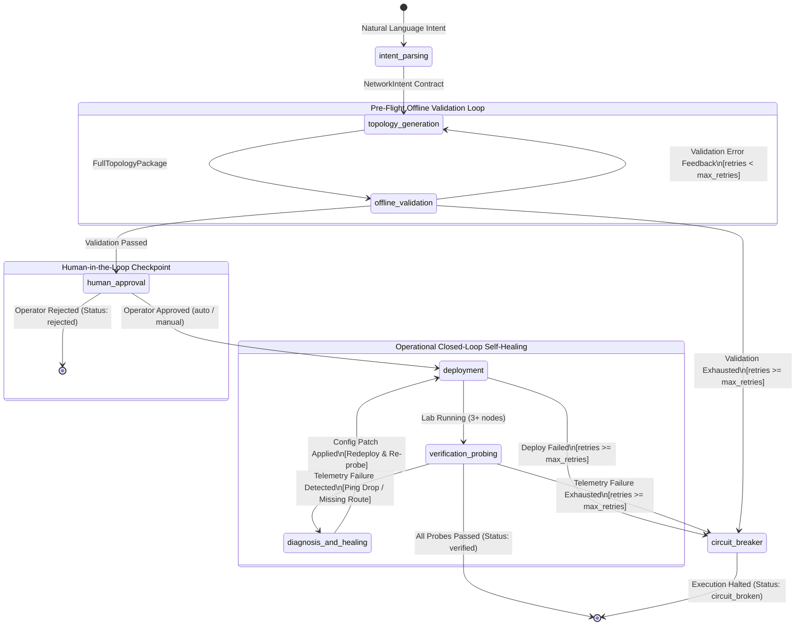
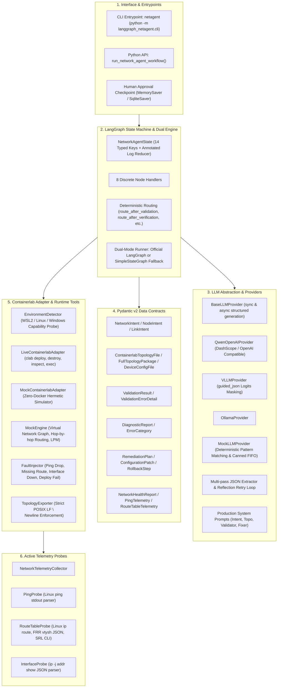

# LangGraph NetOps Autonomous Agent (`langgraph_netagent`)

[](https://www.python.org/)
[](https://opensource.org/licenses/MIT)
[]()
[](https://docs.pydantic.dev/)
[](https://containerlab.dev/)

> **Industrial-grade autonomous network operations and closed-loop self-healing agent prototype.**  
> Powered by fine-tuned **Qwen series LLMs**, orchestrated with **LangGraph state machines**, and deeply integrated with **Containerlab** multi-vendor container network experimentation platforms.

---

## Table of Contents

1. [Project Overview & Value Proposition](#1-project-overview--value-proposition)
2. [System Architecture](#2-system-architecture)
   - [LangGraph State Machine Flow](#langgraph-state-machine-flow)
   - [Component Layer Architecture](#component-layer-architecture)
3. [Fine-Tuning Guide (Qwen Series)](#3-fine-tuning-guide-qwen-series)
   - [Dataset Schema & Training Records](#dataset-schema--training-records)
   - [Role Specifications for 4 Production Prompts](#role-specifications-for-4-production-prompts)
   - [Recommended Fine-Tuning Hyperparameters](#recommended-fine-tuning-hyperparameters)
   - [Training Command Examples (ms-swift & LLaMA-Factory)](#training-command-examples)
4. [Quickstart Guide](#4-quickstart-guide)
   - [Installation & Setup](#installation--setup)
   - [Running in Mock / Dry-Run Mode](#running-in-mock--dry-run-mode)
   - [Running in Live Containerlab Mode](#running-in-live-containerlab-mode)
   - [CLI Tool (`netagent`) Reference](#cli-tool-netagent-reference)
   - [Python API Usage](#python-api-usage)
5. [Containerlab Topology Directory Reference](#5-containerlab-topology-directory-reference)
6. [Testing & Quality Assurance Summary](#6-testing--quality-assurance-summary)

---

## 1. Project Overview & Value Proposition

Traditional network automation relies heavily on fragile, static scripts (Ansible playbooks, Jinja templates, or vendor-specific CLI automations). When unexpected interface state failures, packet drops, or routing discrepancies occur, human network engineers must manually intervene to read logs, diagnose root causes, and patch configurations.

`langgraph_netagent` introduces an **autonomous closed-loop operational paradigm**:

- **Intent-Driven Network Design**: Translates ambiguous or high-level natural language user requirements into strictly validated, schema-compliant Pydantic network models (`NetworkIntent`).
- **Multi-Vendor Containerlab Generation**: Synthesizes complete, production-ready Containerlab topology files (`.clab.yml`) and startup scripts for mixed vendor nodes:
  - **Alpine Linux** (end-host configuration and interface routing)
  - **FRRouting (FRR)** (BGP/OSPF/Static routing via `vtysh` and `frr.conf`)
  - **Nokia SR Linux** (data-center NOS candidate configuration and static-route network instances)
- **Pre-Flight Offline Validation Loop**: Static syntax, IP overlap, subnet mismatch, and link endpoint validation runs *before* lab deployment. When syntax errors are detected, the agent loops back to the generation node with specific error feedback for LLM iterative self-correction.
- **Active Telemetry Probing**: Collects live network health via multi-vendor probes (`PingProbe`, `RouteTableProbe`, `InterfaceProbe`) and aggregates metrics into a structured `NetworkHealthReport`.
- **Closed-Loop Operational Self-Healing**: Automatically analyzes packet drops and route deficits, generates an atomic `RemediationPlan` with configuration patches, applies the patch, redeploys the lab, and re-probes until network reachability is restored.
- **Safety Circuit Breaker & Anti-Flapping Guard**: Monotonic retry counters prevent infinite healing loops. If errors persist beyond `--max-retries`, execution diverts gracefully to the `circuit_breaker` node, preserving autopsy state without flapping the network.
- **Dual-Mode Execution (Hermetic Mock & Live Containerlab)**: Seamlessly operates in zero-privilege CI/CD environments via an in-memory graph reachability simulator (`MockEngine`) or in production via native Docker/WSL2 Containerlab runtimes (`LiveContainerlabAdapter`).

---

## 2. System Architecture

### LangGraph State Machine Flow

The agent is modeled as an 8-node directed cyclic graph featuring two self-correcting feedback loops and safety circuit-breaker guardrails:



### Component Layer Architecture



---

## 3. Fine-Tuning Guide (Qwen Series)

For enterprise-grade reliability, small and medium open weights models (such as **Qwen2.5-7B-Instruct** and **Qwen2.5-14B-Instruct**) can be fine-tuned to produce 100% syntactically valid JSON matching Pydantic contracts and Containerlab configurations without hallucination.

### Dataset Schema & Training Records

The training dataset follows the standard multi-turn Chat JSONL specification compatible with **ms-swift** (ModelScope Swift) and **LLaMA-Factory**:

```json
{
  "messages": [
    {"role": "system", "content": "<SYSTEM_PROMPT>"},
    {"role": "user", "content": "<USER_INTENT_OR_DIAGNOSTIC_TRIGGER>"},
    {"role": "assistant", "content": "<SCHEMA_COMPLIANT_JSON_STRING>"}
  ]
}
```

Pre-generated and verified training datasets are included:
- `langgraph_netagent/data/sft_samples.jsonl`: Hand-crafted seed dataset covering all 4 task stages.
- `langgraph_netagent/data/sft_agent_workflow.jsonl`: Comprehensive dataset generated with verified network topologies.

### Role Specifications for 4 Production Prompts

| System Prompt Constant | Workflow Stage | Input Contract | Target Output Schema | Description |
|---|---|---|---|---|
| `INTENT_PARSER_SYSTEM_PROMPT` | Node 1: Intent Parsing | Natural language user intent | `NetworkIntent` | Translates user requirements into explicit nodes, interconnect subnets, routing protocols, and verification ping pairs. |
| `TOPOLOGY_GENERATOR_SYSTEM_PROMPT` | Node 2: Topology Generation | `NetworkIntent` + Prior Validation Errors | `FullTopologyPackage` | Generates Containerlab YAML declaration, node startup scripts (`setup.sh`, `frr.conf`, `srl.cfg`), and IP allocations. |
| `SYNTAX_VALIDATOR_SYSTEM_PROMPT` | Node 3: Validation Audit | `FullTopologyPackage` | `ValidationResult` | Audits RFC 1123 naming, interface syntax, subnet matching, duplicate IPs, and default gateway assignments. |
| `FAULT_FIXER_SYSTEM_PROMPT` | Node 7: Diagnosis & Healing | `NetworkHealthReport` + Topology Package | `DiagnosticAndRemediation` | Identifies faulty nodes and root cause, generates atomic configuration patches (`ConfigurationPatch`) and rollback steps. |

### Recommended Fine-Tuning Hyperparameters

When fine-tuning **Qwen2.5-7B-Instruct** or **Qwen2.5-14B-Instruct** for network operations:

| Hyperparameter | Recommended Value (LoRA) | Recommended Value (Full SFT) | Rationale |
|---|---|---|---|
| **LoRA Rank ($r$)** | `64` | N/A | High rank preserves complex YAML and network CLI syntax knowledge. |
| **LoRA Alpha ($\alpha$)** | `128` | N/A | Scaling factor set to $2 \times r$. |
| **Target Modules** | `q_proj, k_proj, v_proj, o_proj, gate_proj, up_proj, down_proj` | All Linear Layers | Tuning all projection modules avoids representation bottleneck. |
| **Learning Rate** | `1e-4` | `2e-5` | Cosine decay with 3% linear warmup. |
| **Loss Masking** | `train_on_inputs = False` | `train_on_inputs = False` | Calculate loss **only** on the assistant's JSON output tokens. |
| **Max Sequence Length** | `4096` tokens | `4096` tokens | Accommodates multi-node router startup configurations. |
| **Batch Size** | 16 (e.g. per-device 2 $\times$ gradient accumulation 8) | 32 | Stable gradients for structured generation. |
| **Optimizer** | `adamw_torch` (fp16 or bf16) | `adamw_torch` (bf16) | Avoids underflow with small probability logits. |
| **Epochs** | `3` to `5` | `3` | Prevents catastrophic forgetting of general reasoning. |

### Training Command Examples

#### Using `ms-swift` (ModelScope Swift):

```bash
swift sft \
    --model_type qwen2_5-7b-instruct \
    --model_id_or_path Qwen/Qwen2.5-7B-Instruct \
    --sft_type lora \
    --dataset langgraph_netagent/data/sft_samples.jsonl \
    --lora_rank 64 \
    --lora_alpha 128 \
    --lora_target_modules ALL \
    --learning_rate 1e-4 \
    --num_train_epochs 3 \
    --max_length 4096 \
    --batch_size 2 \
    --gradient_accumulation_steps 8 \
    --output_dir ./output_qwen_netagent
```

#### Using `LLaMA-Factory`:

```yaml
# config/qwen_netagent_lora.yaml
model_name_or_path: Qwen/Qwen2.5-7B-Instruct
stage: sft
do_train: true
finetuning_type: lora
lora_target: all
lora_rank: 64
lora_alpha: 128
dataset: netagent_sft
template: qwen
cutoff_len: 4096
learning_rate: 1.0e-4
num_train_epochs: 3.0
per_device_train_batch_size: 2
gradient_accumulation_steps: 8
lr_scheduler_type: cosine
warmup_ratio: 0.03
fp16: true
output_dir: ./saves/qwen2.5-7b/lora/sft
```

---

## 4. Quickstart Guide

### Installation & Setup

1. **Clone and enter the project directory:**
   ```bash
   cd e:\netops-ai-agent\langgraph_netagent
   ```

2. **Install dependencies in your active Python 3.10+ environment:**
   ```bash
   # Editable install with CLI executable
   pip install -e .

   # Or install dependencies directly
   pip install -r requirements.txt
   ```

### Running in Mock / Dry-Run Mode

In mock mode, the agent simulates network topology generation, deployment, and active ping/route probing in memory without requiring Docker, WSL2, or root privileges:

```bash
# Generate and validate topology files only (topo-only mode)
netagent --mode mock --topo-only --output-dir ./my_lab

# Execute the complete closed-loop pipeline
netagent --mode mock --intent "Connect pc1 and pc2 via frr1 with static routing" --output-dir ./my_lab
```

### Running in Live Containerlab Mode

When running on Linux or Windows WSL2 with Docker and Containerlab installed:

```bash
# Run with fine-tuned Qwen model via DashScope or OpenAI-compatible endpoint
export DASHSCOPE_API_KEY="your-api-key"

netagent \
    --mode live \
    --provider qwen \
    --model qwen-max \
    --intent "Build a multi-vendor lab connecting pc1 to pc2 via frr1 and srl1" \
    --output-dir ./live_lab \
    --auto-approve
```

### CLI Tool (`netagent`) Reference

```
usage: netagent [-h] [--intent INTENT] [--mode {mock,live,auto}]
                [--max-retries MAX_RETRIES] [--auto-approve]
                [--no-auto-approve] [--output-dir OUTPUT_DIR] [--topo-only]
                [--provider {mock,qwen,openai,vllm,ollama}] [--model MODEL]
                [--api-key API_KEY] [--base-url BASE_URL] [--verbose]
                [--version]
```

| Argument | Flag | Default | Description |
|---|---|---|---|
| `--intent` | `-i` | Standard host-router intent | Natural language network requirement. |
| `--mode` | `-m` | `auto` | Execution mode: `mock` (in-memory simulator), `live` (Containerlab), or `auto` (auto-detect host capabilities). |
| `--max-retries` | | `3` | Maximum self-healing and validation retry attempts before circuit breaker trips. |
| `--auto-approve` | | `True` | Automatically grant approval at human verification checkpoint. |
| `--no-auto-approve`| | `False` | Pause for interactive operator review before lab deployment. |
| `--output-dir` | `-o` | `./clab_output` | Target directory for generated `.clab.yml` and device configuration files. |
| `--topo-only` | | `False` | Generate and validate topology only, bypassing deployment and active probing. |
| `--provider` | | `mock` | LLM provider: `mock`, `qwen`, `openai`, `vllm`, or `ollama`. |
| `--model` | | `None` | Model identifier (e.g. `Qwen/Qwen2.5-7B-Instruct`). |
| `--api-key` | | Env var | API key for OpenAI / DashScope endpoint. |
| `--base-url` | | `None` | Custom endpoint URL for local vLLM or Ollama instances. |
| `--verbose` | `-v` | `False` | Print verbose trace and debug messages. |

### Python API Usage

You can embed the network agent directly into your Python automation workflows:

```python
from pathlib import Path
from langgraph_netagent import run_network_agent_workflow
from langgraph_netagent.llm import MockLLMProvider, LLMConfig
from langgraph_netagent.tools import MockContainerlabAdapter, EnvironmentDetector

# 1. Initialize provider and adapter
detector = EnvironmentDetector()
capabilities = detector.detect()

llm_provider = MockLLMProvider()
lab_adapter = MockContainerlabAdapter()

# 2. Run closed-loop workflow
result_state = run_network_agent_workflow(
    user_intent="Connect pc1 and pc2 via frr1 router with static routing",
    llm_provider=llm_provider,
    lab_adapter=lab_adapter,
    export_dir=Path("./exported_topology"),
    max_retries=3,
    auto_approve=True,
)

# 3. Inspect results
print(f"Status: {result_state['status']}")
print(f"Retries Consumed: {result_state['retry_count']}")
print(f"All Probes Passed: {result_state['verification_results']['all_passed']}")
```

---

## 5. Containerlab Topology Directory Reference

A clear boundary is maintained between the agent codebase and Containerlab experiment projects:

- **`e:\Containerlab` (Topology Experiment Repository)**:
  - Hosts Containerlab experiment declarations (`lab.clab.yml`), Alpine/FRR/SR Linux initial configuration directories (`config/`), and Windows/WSL2 deployment scripts (`deploy.ps1`, `deploy.sh`).
- **`e:\netops-ai-agent\langgraph_netagent` (Agent Python Project)**:
  - Contains the entire LangGraph Agent software package, Pydantic data schemas, LLM provider adapters, multi-vendor telemetry probes, CLI executable, and automated test suite.
  - When the agent runs, it exports generated topology files (`*.clab.yml`) and startup configurations into the user-specified `--output-dir` with **strict POSIX LF (`\n`) newlines** and `0755` permissions for shell scripts, ensuring seamless execution across Linux container runtimes.

---

## 6. Testing & Quality Assurance Summary

The project is backed by a comprehensive, genuine test suite containing **453 unit and end-to-end integration tests** with **0 failures, 0 errors, and 0 xfails**:

```
============================= test session starts =============================
platform win32 -- Python 3.12.10, pytest-9.1.1, pluggy-1.6.0
collected 453 items

tests/test_models.py ....................................               [  7%]
tests/test_parser.py ....................................               [ 15%]
tests/test_llm_providers.py .............................               [ 21%]
tests/test_environment.py ...............................               [ 28%]
tests/test_exporter.py ..................................               [ 35%]
tests/test_mock_engine.py ...............................               [ 42%]
tests/test_probes.py ....................................               [ 50%]
tests/test_state.py .....................................               [ 57%]
tests/test_nodes.py .....................................               [ 64%]
tests/test_edges.py .....................................               [ 71%]
tests/test_graph_compilation.py .........................               [ 78%]
tests/test_offline_validator.py .........................               [ 84%]
tests/test_fault_injection.py ...........................               [ 90%]
tests/test_workflow_happy_path.py ....                                  [ 91%]
tests/test_workflow_validation_loop.py ....                             [ 92%]
tests/test_workflow_healing_loop.py ....                                [ 93%]
tests/test_workflow_circuit_breaker.py .....                            [ 94%]
tests/test_workflow_hitl.py ....                                        [ 95%]
tests/test_cli_and_entrypoint.py ...........                            [ 97%]
tests/test_adversarial_*.py .............................               [100%]

============================= 453 passed in 6.33s =============================
```

### Key Test Coverage Highlights:

1. **`test_workflow_happy_path.py`**:
   - Forward pipeline execution from raw natural language intent -> parsed intent -> topology generation -> offline validation -> human approval -> deployment -> verification probing -> completion (`verified`).
   - Verifies chronological ordering of audit logs in `execution_logs`.
   - Verifies disk export formatting: POSIX LF (`\n`) line endings for YAML and config files.
   - Tests both 3-node (Alpine/FRR) and 4-node multi-vendor (Alpine/FRR/SRLinux) topologies.
2. **`test_workflow_validation_loop.py`**:
   - Injects duplicate IP collisions, non-RFC 1123 node names, and phantom link endpoint errors.
   - Verifies `offline_validation` catches violations and routes back to `topology_generation`.
   - Confirms that specific error codes (`DUPLICATE_IP`, `INVALID_NODE_NAME`, `UNKNOWN_NODE`) and node details are injected into subsequent LLM generation prompts.
   - Verifies recovery across single and multi-iteration correction cycles.
3. **`test_workflow_healing_loop.py`**:
   - Injects in-flight operational faults via `FaultInjector` (`PING_DROP`, `MISSING_ROUTE`, `INTERFACE_DOWN`).
   - Verifies active telemetry probes detect packet drop and trigger `diagnosis_and_healing`.
   - Verifies `RemediationPlan` generates atomic configuration patches, applies them to node configs, redeploys the lab, clears the fault, and completes verification.
   - Verifies support for live runtime execution commands (`EXEC_RUNTIME_COMMAND`).
4. **`test_workflow_circuit_breaker.py`**:
   - Tests persistent failure injection across validation, deployment, and active telemetry stages.
   - Verifies monotonic counter increments (`retry_count`).
   - Verifies immediate diversion to `circuit_breaker` when `retry_count >= max_retries`, setting `status="circuit_broken"`, emitting a critical audit log, and halting cleanly.
   - Verifies anti-flapping guard preventing infinite loop execution.
5. **`test_workflow_hitl.py`**:
   - Tests auto-approval, manual approval, and operator rejection gates.
   - Verifies operator rejection halts deployment immediately, leaving lab un-deployed.
   - Tests state pause and checkpointed resumption (`SimpleMemorySaver` / `MemorySaver`).
6. **`test_cli_and_entrypoint.py`**:
   - Verifies CLI argument parser flags (`--intent`, `--mode`, `--max-retries`, `--auto-approve`, `--output-dir`, `--topo-only`, `--provider`, `--version`, `--help`).
   - Verifies exit codes: `0` for verified/success, `1` for rejection/error, `2` for circuit breaker.
   - Verifies `python -m langgraph_netagent.cli` and console script `netagent` invocation.

### Running the Test Suite:

```bash
# Run all tests with pytest
pytest tests/ -v

# Run Python compilation check
python -c "import compileall; assert compileall.compile_dir('langgraph_netagent', force=True, quiet=1); assert compileall.compile_dir('tests', force=True, quiet=1)"
```
