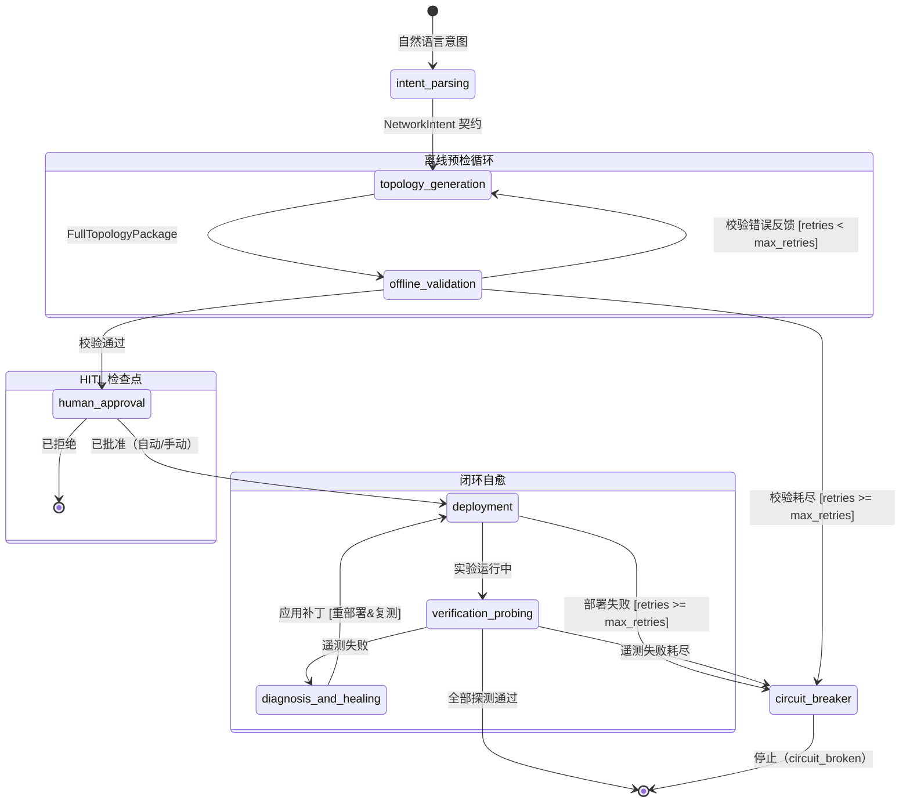
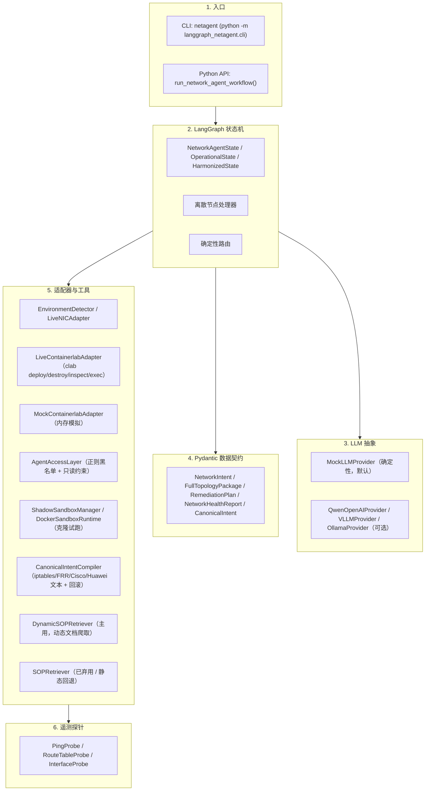

# LangGraph NetOps Agent（`langgraph_netagent`）

[](https://www.python.org/)
[](https://opensource.org/licenses/MIT)
[]()
[](https://docs.pydantic.dev/)

> **研究原型（非生产系统）**：闭环自愈网络运维 Agent 的参考实现。默认使用确定性 `mock` 提供器（无真实推理），可选接 Qwen/OpenAI 兼容 LLM；以 **LangGraph 状态机**编排，接入 **Containerlab** 多厂商容器实验网。

---

## 目录

1. [项目概览](#1-项目概览)
2. [系统架构](#2-系统架构)
3. [快速上手](#3-快速上手)
4. [Containerlab 拓扑目录约定](#4-containerlab-拓扑目录约定)
5. [测试与质量](#5-测试与质量)

---

## 1. 项目概览

传统网络自动化依赖脆弱、静态的脚本。本原型演示一种**自主闭环运维范式**：

- **意图驱动拓扑**：把自然语言需求翻译为校验过的 Pydantic 模型（`NetworkIntent`）。
- **多厂商 Containerlab 生成**：产出 Alpine Linux / FRRouting / Nokia SR Linux 的拓扑文件与启动脚本。
- **离线预检闭环**：部署前做语法 / IP 重叠 / 子网 / 链路端点校验，出错时回传错误信息触发迭代修正。
- **主动遥测探针**：`PingProbe` / `RouteTableProbe` / `InterfaceProbe` 采集网络健康。
- **闭环自愈**：分析丢包与路由缺失，生成 `RemediationPlan`，打补丁、重部署、复测直至恢复。
- **熔断与防抖**：单调重试计数防止无限自愈循环，超限转熔断节点。

> **边界说明**：上述「诊断」主要为规则 + 模板驱动（见 `workflow/operational_nodes.py` 的 `classify_anomaly` 与写死回退值），LLM 仅参与报告文案生成且默认使用 `mock`。更完整的诚实梳理见根目录 [`PROJECT.md`](../PROJECT.md)。

---

## 2. 系统架构

### 旧版 Greenfield 状态机（8 节点，`--topo-only` 路径）

该图描述最早版本的「从零建网」流程（当前主用路径为 Operational / Harmonized，见根 README）：



### 组件分层



---

## 3. 快速上手

### 安装

```bash
# 可编辑安装（在 langgraph_netagent 目录内）
pip install -e .
# 或从根目录
pip install -e ../
```

### Mock / Dry-Run 模式（零 Docker）

```bash
netagent --harmonized --mode mock
netagent --mode mock --intent "Connect pc1 and pc2 via frr1 with static routing" --output-dir ./my_lab
```

### Live Containerlab 模式（Linux / WSL2 + Docker + Containerlab）

```bash
export DASHSCOPE_API_KEY="your-api-key"

netagent --harmonized --mode live --lab-name clos5 --provider qwen --model qwen-max --auto-approve
```

### CLI 参数

```
usage: netagent [-h] [--intent INTENT] [--mode {mock,live,auto}]
                [--max-retries MAX_RETRIES] [--auto-approve] [--no-auto-approve]
                [--interactive] [--output-dir OUTPUT_DIR] [--topo-only] [--day2]
                [--harmonized] [--lab-name LAB_NAME] [--scan]
                [--watch] [--watch-interval WATCH_INTERVAL]
                [--max-watch-cycles MAX_WATCH_CYCLES]
                [--provider {mock,qwen,openai,vllm,ollama}] [--model MODEL]
                [--api-key API_KEY] [--base-url BASE_URL] [--verbose] [--version]
```

| 参数 | 默认 | 说明 |
|---|---|---|
| `--intent` | 标准意图 | 自然语言网络需求 |
| `--mode` | `auto` | `mock` / `live` / `auto` |
| `--max-retries` | `3` | 熔断前最大重试 |
| `--auto-approve` | True | 自动通过 HITL |
| `--interactive` / `-it` | False | 交互式 REPL |
| `--output-dir` / `-o` | `./clab_output` | 输出目录 |
| `--topo-only` | False | 仅生成并校验拓扑（弃用） |
| `--day2` | False | 已定义但未接入执行流 |
| `--harmonized` | False | Day-1/2/3 统一工作流 |
| `--lab-name` | None | Containerlab 实验名 |
| `--scan` | False | 扫描网卡/拓扑 |
| `--watch` / `-w` | False | 持续监控自愈循环 |
| `--provider` | `mock` | LLM 后端 |
| `--version` | | 版本号 |

### Python API

```python
from pathlib import Path
from langgraph_netagent import run_network_agent_workflow
from langgraph_netagent.llm import MockLLMProvider
from langgraph_netagent.tools import MockContainerlabAdapter

llm_provider = MockLLMProvider()
lab_adapter = MockContainerlabAdapter()

result_state = run_network_agent_workflow(
    user_intent="Connect pc1 and pc2 via frr1 router with static routing",
    llm_provider=llm_provider,
    lab_adapter=lab_adapter,
    export_dir=Path("./exported_topology"),
    max_retries=3,
    auto_approve=True,
)

print(f"Status: {result_state['status']}")
print(f"Retries: {result_state['retry_count']}")
```

---

## 4. Containerlab 拓扑目录约定

Agent 代码库与 Containerlab 实验项目分离：

- **`langgraph_netagent`（本目录）**：Agent 软件包、数据模型、provider 适配器、探针、CLI、测试。
- 生成的拓扑文件（`*.clab.yml`）与启动配置写入用户指定的 `--output-dir`，使用 POSIX LF（`\n`）换行与 `0755` 脚本权限，保证跨 Linux 容器运行。

---

## 5. 测试与质量

测试套件包含 **1449 个自动化测试用例**（实际运行 `pytest` 以获取权威数量）：

```bash
# 运行全部测试
pytest tests/ -q

# 编译检查
python -c "import compileall; compileall.compile_dir('langgraph_netagent', force=True, quiet=1)"
```

主要覆盖方向：

- 模型 / 解析器 / LLM provider
- 环境探测 / 导出器 / Mock 引擎
- 遥测探针 / 状态机 / 图编译
- 离线校验 / 故障注入
- 工作流 happy-path / 校验环 / 自愈环 / 熔断 / HITL
- AAL / 隔离拦截 / 意图编译 / 厂商知识 / 两阶段诊断 / 持续监控 / 对抗测试

> 说明：微调样例数据位于 `langgraph_netagent/data/`（`sft_samples.jsonl`、`sft_agent_workflow.jsonl`），生成脚本为 `generate_agent_sft.py`，可用于 Qwen2.5 系列微调实验；此前文档中「100% 无幻觉」等表述为过度表述，已移除。
